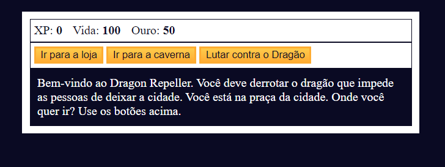

# Jogo de RPG - Dragon Repeller

Bem-vindo ao meu jogo de RPG - Dragon Repeller! Este é um jogo simples em desenvolvimento usando HTML, CSS e JavaScript, onde os jogadores podem embarcar em aventuras emocionantes em um mundo de fantasia.

## Funcionalidades

- **Batalhas épicas:** Enfrente monstros poderosos em batalhas.
- **Sistema de inventário:** Compra e venda os itens do seu personagem.
- **Sistema bancário:** Gerenciamento dos seus ouros.
- **Exploração:** Descubra terras desconhecidas, cidades misteriosas e masmorras perigosas.

## Como Jogar

Acesse: 

## Capturas de Tela

## Autor

Desenvolvedor Marlon Jhoni.

## Agradecimentos

- Inspiração e recursos fornecidos pelo site: https://www.freecodecamp.org/
